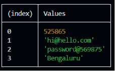

# js-repo
A code repo for JavaScript

# const - It is used when the value can not be changed
# let - it is also used to declare variable in JS, it has lexical scope
# var - it is used to declare variable in JS, it has global scope

## To print variables to the console:
1. console.log() : it will show only one variable
2. console.table([varibales name]) : it shows all the values of variables in a tabular form



## ==> use of "use strict" in JS, allows user to use newer version of JS, The purpose of "use strict" is to indicate that the code should be executed in "strict mode".

* With strict mode, you can not, for example, use undeclared variables.

### Example:
#### "use strict";
```
x = 3.14;       // This will cause an error because x is not declared
```
#### "use strict";
myFunction();

``` 
function myFunction() {
   y = 3.14;   // This will also cause an error because y is not declared
}
```